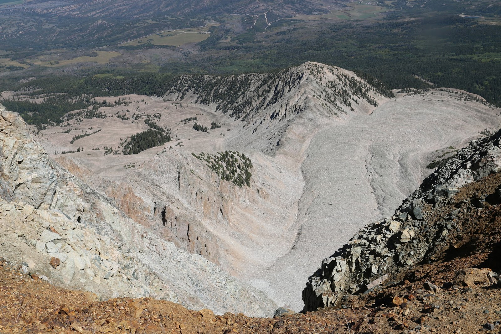

# Juliana's Fabulous Earth Data Science Portfolio

"I was looking upon the counterpart of the great river systems of Arctic Asia and America...a plastic, moving, semi-solid mass...ploughing its way with irresistable march through the crust of an investing sea" 

*Elisha Kent Kane, on the Humbold Glacier, Greenland (1854)*

***

## Academic Interests

The global physical environment is a vast and complex machine composed of numerous interconnected systems capable of dramatic change over brief intervals of time. A solid understanding of the character and dynamics of this machine can explain a diversity of engaging geographical phenomena, from the aesthetically stunning views on a high Sierra Nevada mountain summit to the devastating loss of life and property resulting from landslides and floods. I am interested in designing, improving, evaluating, and enjoying such explanations.

My graduate research at CU Boulder will emphasize geomorphological change in high altitude and high latitude regions, focusing on glaciologic problems. This choice reflects the unique and powerful contributions that this subdiscipline makes to environmental change research. Combining a physically based understanding of system dynamics with the reconstruction of “natural experiments” of Earth’s environmental history, I would like to explore questions such as: 
a) 
b) How are microphysical processes in ice manifested at the scale of whole glaciers or ice sheets? 
c)

***
# Current Projects

## 1. Rock Glaciers
> ### What are they? 
Rock glaciers consist of moving ice that is covered in rocks and debris that shield them from melting

> ### Why do we care?

- Most	frequented cryospheric objects in	mid-latitude	mountain	ranges		

- Important	roles	in	mountain hydrology

- Important	roles	in	the	evolution	of	mountain slopes	over	the	short	and	long term

- Past climate indicator

- Primary	markers	of	mountain	permafrost	evolution

- Represent	a	real	natural risk …

## Juneau Icefield 

***

Interesting Side Projects:  

* [Temperature over time in Barrow, AK],(https://julesmruef.github.io/notebooks/ncei_temp_barrow.html)
* [Pajaro Valley Flooding History], (https://julesmruef.github.io/notebooks/watsonville_time_series.html)
* [Woolsey Fire NDVI Analysis], (file:///Users/julianaruef/Downloads/01-modis-ndvi-woolsey-fire.html)

