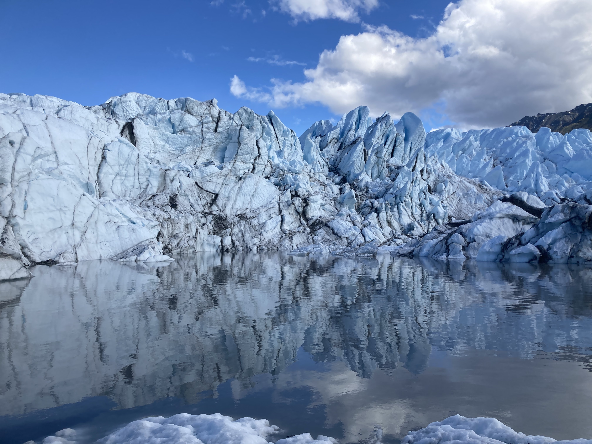

# Juliana's Fabulous Earth Data Science Portfolio

"I was looking upon the counterpart of the great river systems of Arctic Asia and America...a plastic, moving, semi-solid mass...ploughing its way with irresistable march through the crust of an investing sea" 

*Elisha Kent Kane, on the Humbold Glacier, Greenland (1854)*

## Project Number 1 
This project is about....

## Project Number 2
This project is about....
